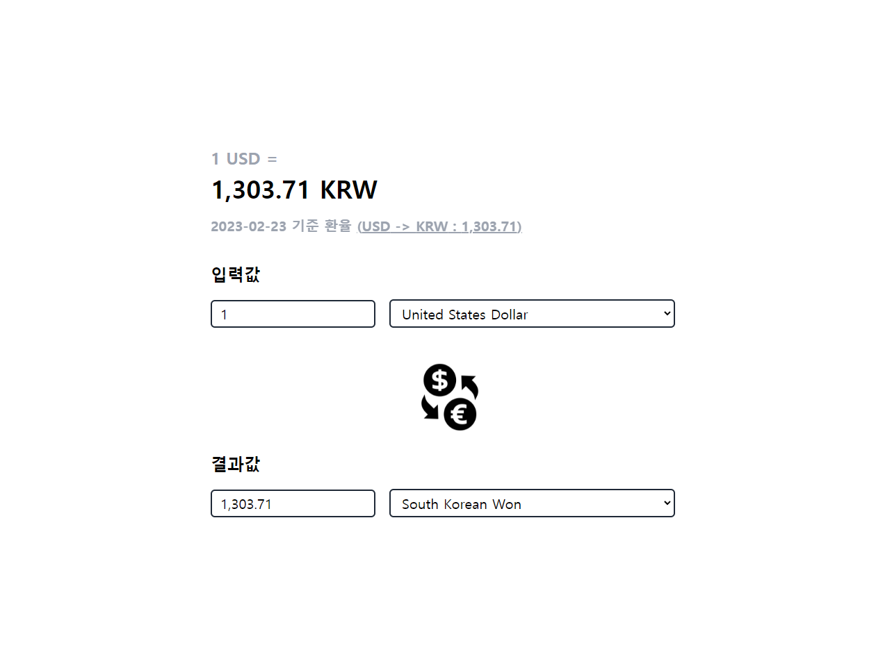
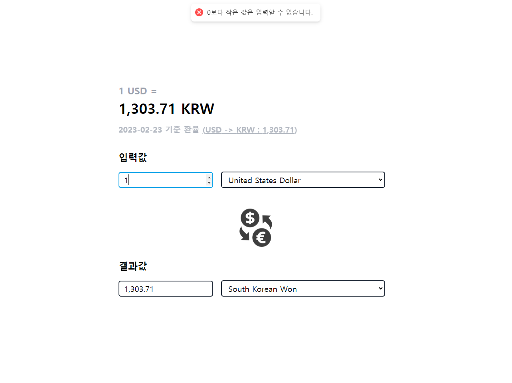
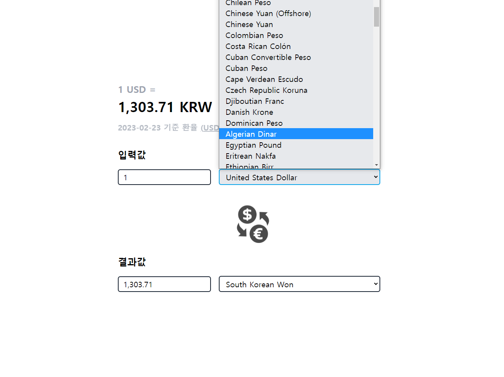
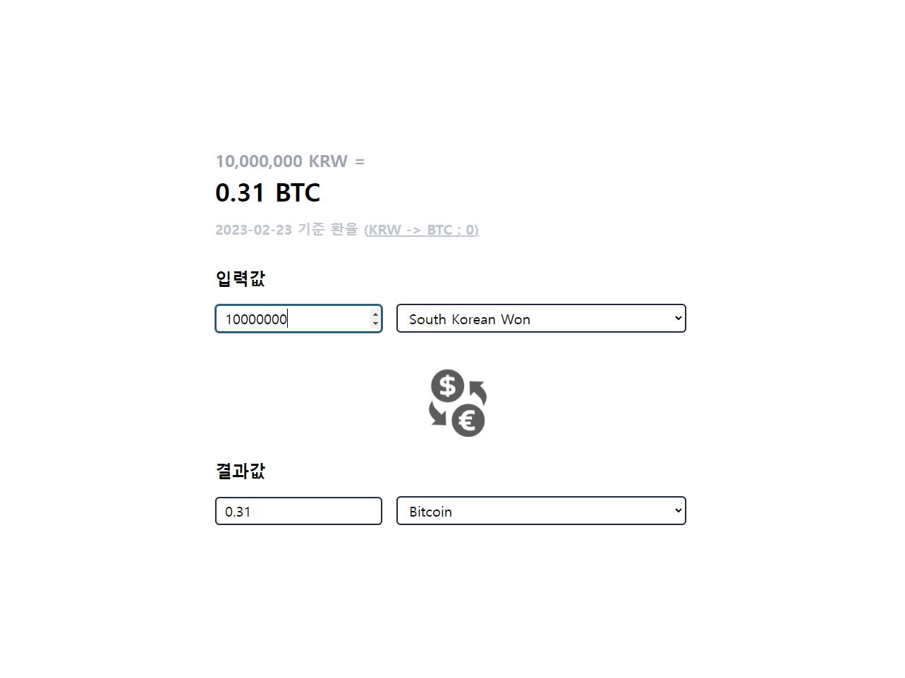

# `API`를 활용한 환전 웹

`exchangerate.host API`를 활용하여 만들어진 간단한 환전소 사이트입니다.

### <b>사이트 링크 : [Currency Exchange](https://currency-exchange-chi.vercel.app/)</b>

 

# 1. Tech

- Front-End
   

  &nbsp;
  &nbsp;
  

 

- Deploy
   

  

 

- Edit Tool
   

  &nbsp;
  &nbsp;
  

 

- Open API
   

  [`exchangerate.host`](https://exchangerate.host/#/)

  

# 3. 프로젝트 상세 내용

| 메인 화면                                   |
| ------------------------------------------- |
| 기본값으로 미국 달러(1$)를 한국 원화로 설정 |
|     |

| 입력 에러 설정                                                          |
| ----------------------------------------------------------------------- |
| 0 미만의 음수의 값을 입력할 시, 에러 메세지 출력 및 입력값을 1로 초기화 |
| `react-hot-toast` 라이브러리 사용                                       |
|                                |

| 국가 선택                                                   |
| ----------------------------------------------------------- |
| 입력값과 결과값의 국가 선택 후, 입력값에 원하는 금액을 입력 |
|                   |

| `BitCoin` 환전 결과                              |
| ------------------------------------------------ |
| 별도의 버튼 없이 실시간으로 환전률과 결과값 출력 |
|           |

